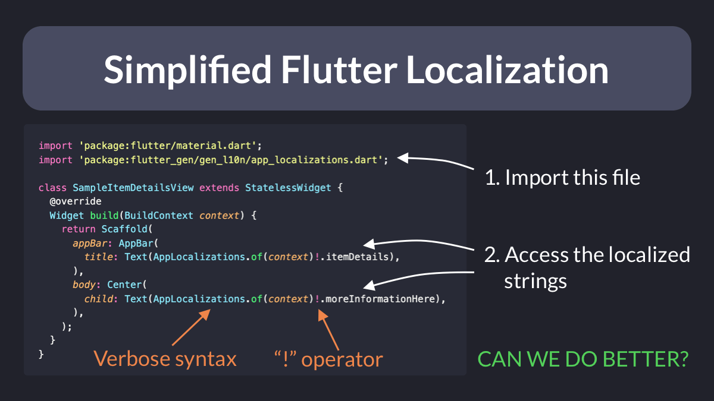
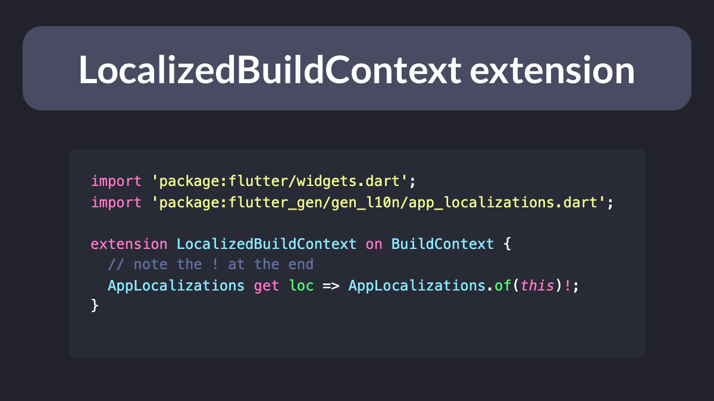
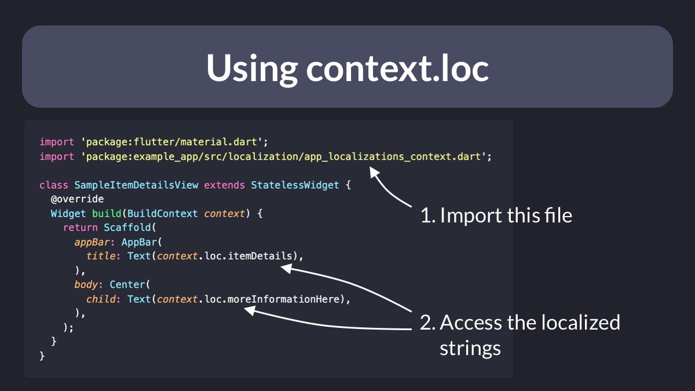

# Simplified Flutter App Localization

The default way of accessing localized strings inside your widgets is to use the `AppLocalizations` class.

However, using the `!` operator everywhere is not good practice.

And it would be nice to have some more "lightweight" syntax.

A thread. 🧵

---

One issue we have is that `AppLocalizations.of(context)` returns a **nullable** object.

But at runtime this will never be null, as long as we call it inside a **descendant** of `MaterialApp` (which is always the case).

So what can we do?

---

Dart extensions to the rescue!

We can define a `LocalizedBuildContext` extension with a `loc` getter variable defined like so:

---

And now, whenever we need localized strings in our widgets, we can:

- import the file that defines the new extension
- use `context.loc.someString` to get the value we need

---

If you have dozens or hundreds of localized strings, this amounts to a lot of developer happiness! 😀

If you found this thread useful, retweet the first tweet and spread the word. 🙏

To see more Flutter tips like this in your timeline, just follow me: [@biz84](https://twitter.com/biz84)

Happy coding!

---

### Found this useful? Show some love and share the [original tweet](https://twitter.com/biz84/status/1486349439086256139) 🙏

### Also published on codewithandrea.com 👇

- [Simplified Flutter Localization using a BuildContext extension](https://codewithandrea.com/articles/flutter-localization-build-context-extension/)