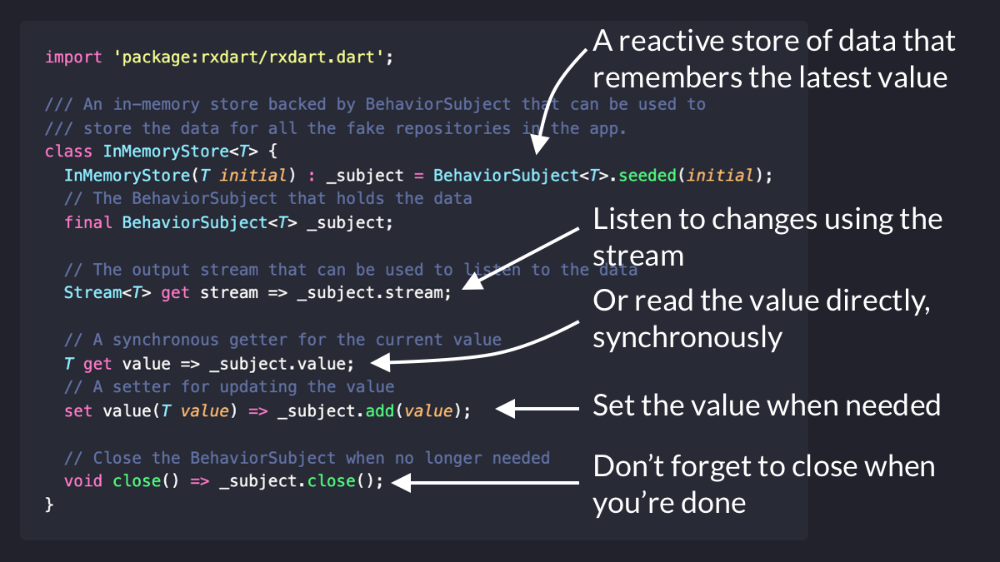

# How to write a reactive in-memory store with RxDart

Ever needed to create a **reactive** in-memory store for simple values?

To help with that, I created a simple wrapper class around `BehaviorSubject` (from the RxDart package).

Here's a (short) thread explaining how to use it. 🧵

---

In this example, we have a "fake" cart repository with async calls for reading and writing data.

This is useful when you don't have a backend (yet), but need something that the rest of the app can use.

As a bonus, it's easy to simulate delays, errors, etc.

---

Once you have this, the rest of the app can use the new Future and Stream-based APIs in the repository.

And later on, you can swap the "fake" repository for a real one (or even keep both for testing/production).

This is covered in more detail here:

- [Flutter App Architecture: The Repository Pattern](https://codewithandrea.com/articles/flutter-repository-pattern/)

---

Aside from `BehaviorSubject`, the RxDart package has many useful APIs for manipulating and combining streams.

You can learn more about it here:

https://pub.dev/packages/rxdart

---

Hope you found this useful.

For more Flutter tips like this, just follow me: [@biz84](https://twitter.com/biz84).

Happy coding!

---

### Found this useful? Show some love and share the [original tweet](https://twitter.com/biz84/status/1511370391259914240) 🙏

---

| Previous | Next |
| -------- | ---- |
| [How to Generate and Analyze a Flutter Test Coverage Report in VSCode](../0042-how-to-generate-and-analyze-a-flutter-test-coverage-report-in-vscode/index.md) | [`AsyncValue.guard()` vs `try`/`catch`](../0044-async-value-guard-vs-try-catch/index.md) |