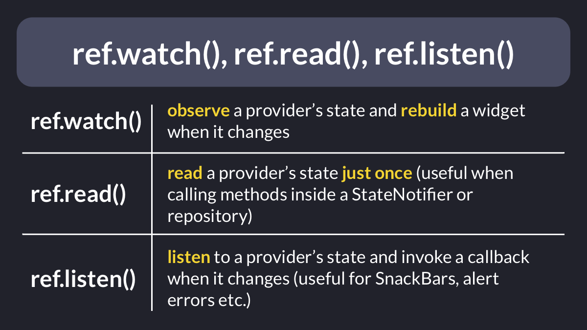
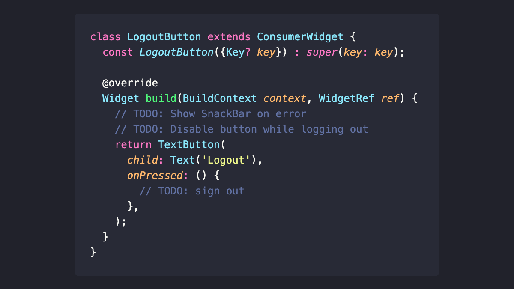
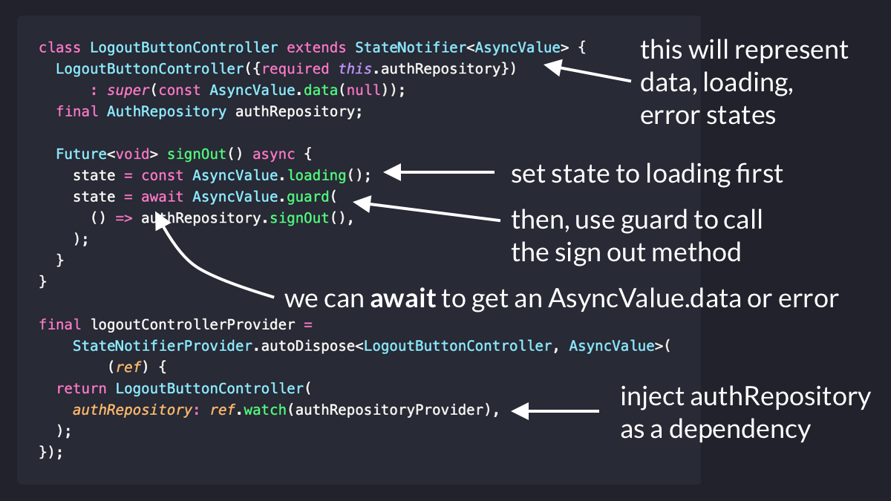
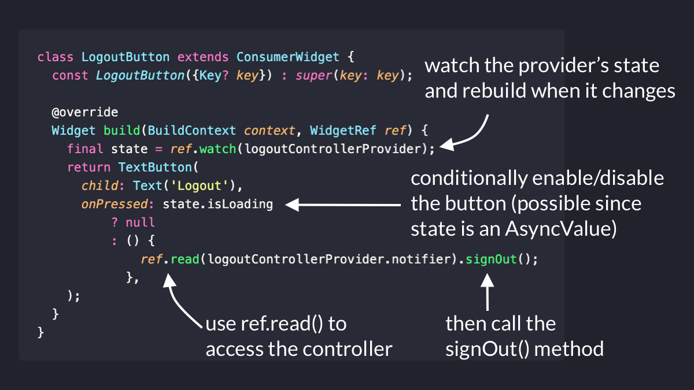
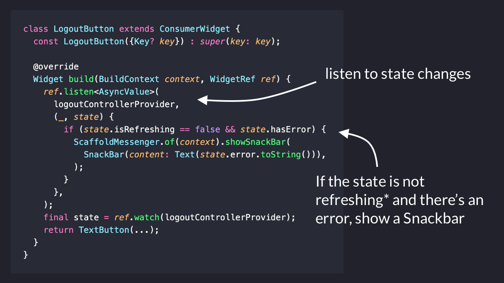
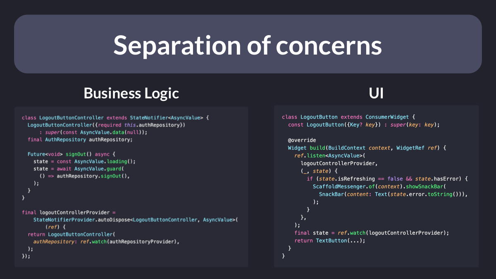

# Riverpod: difference between `ref.watch`, `ref.read`, `ref.listen`

When using Riverpod, what is the difference between `ref.watch()`, `ref.read()` and `ref.listen()`?

It really boils down to this. 👇

For more details, here's a thread. 🧵

---

For example, suppose you have a logout button which behaves like this:

- When pressed, call a method to sign out
- While sign out is in progress, disable the button
- If an error occurs, show a SnackBar

As a starting point, we can create our button as a `ConsumerWidget`:

---

Next up, we can create a `StateNotifier` subclass for our button, along with the corresponding provider.

Note the use of `AsyncValue.guard()`. This can be used as a lightweight alternative to `try`/`catch` as explained here:

https://twitter.com/biz84/status/1516299097594028035

---

Next, let's use the notifier in our widget:

- in the `build()` method, we can call `ref.watch()` to watch the provider's state and disable our button if it's "loading"
- inside the callback, we use `ref.read()` so we can call methods in our notifier

---

What about errors?

We can use `ref.listen()` to trigger a callback every time the state changes.

Inside it, we can check the previous and current state show a `SnackBar` on error.

Note: As of Riverpod 2.0, you'll also want to check `state.isRefreshing`:

https://pub.dev/packages/riverpod/versions/2.0.0-dev.5/changelog#200-dev0

---

Lastly, note how we now have a good separation of concerns:

- our `StateNotifier` manages the widget state and calls the `signOut` method in the auth repository 
- our widget watches state changes and shows the UI

This makes our code more testable and maintainable in the long run.

---

Hope you found this useful.

For more Flutter tips, just follow me: [@biz84](https://twitter.com/biz84).

Btw, my Flutter course already includes 2.5 hours of content about Riverpod, with more planned:

- [The Complete Flutter Course Bundle](https://codewithandrea.com/courses/complete-flutter-bundle/)

Happy coding!

---

### Found this useful? Show some love and share the [original tweet](https://twitter.com/biz84/status/1518503651211362305) 🙏

---

| Previous | Next |
| -------- | ---- |
| [The `Map.update()` method](../0045-the-map-update-method/index.md) | [Why write automated tests?](../0047-why-write-automated-tests/index.md) |