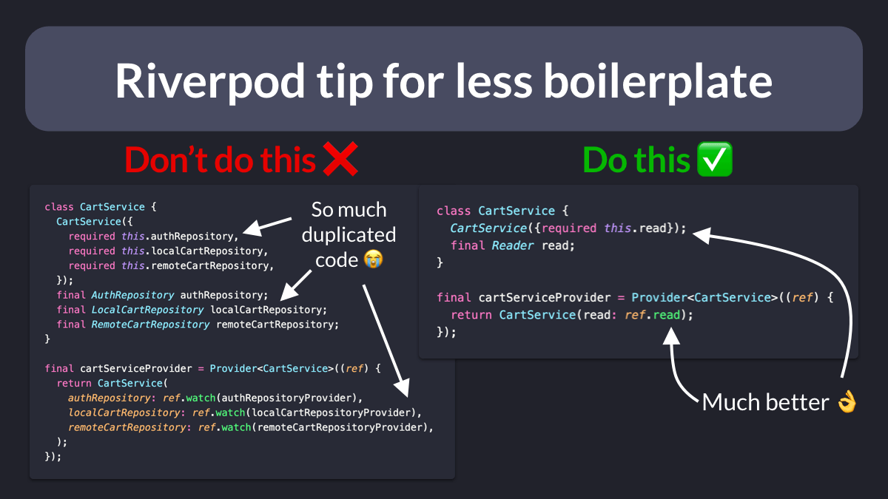
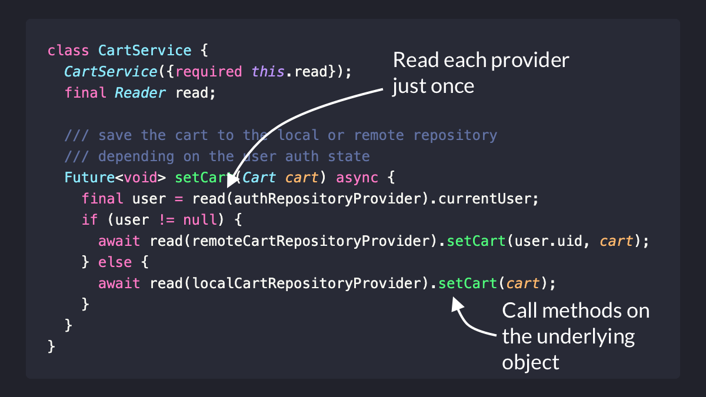

# Riverpod tip for less boilerplate (Passing Ref)

Sometimes we need to write business logic inside classes that have multiple dependencies.

To do this, we can pass the dependencies as constructor arguments.

A much simpler solution is to pass `ref.read` as an argument.

Here's a thread with all the details. 🧵

---

Reader is just a function we can use to read a provider's value, **just once**.

And once we get the underlying value (a repository in this case), we can call methods on it.

Note: when we want to access a provider inside a widget callback, we do exactly the same thing.

---

An alternative way of doing this is to pass `ref` directly.

As a result, we have to call `ref.read(provider).someMethod()` inside our class methods.

Though if you only ever need to read (and not watch or listen), using `Reader` makes your intention more explicit.

---

But how to you write unit tests for classes using `Reader` (or `Ref`)?

Glad you asked!

I'll be covering that in a separate thread (and article) soon. 👍

If you don't wanna miss it, just follow me: [@biz84](https://twitter.com/biz84)

Happy coding!

---

### Found this useful? Show some love and share the [original tweet](https://twitter.com/biz84/status/1534773316145356801) 🙏

---

| Previous | Next |
| -------- | ---- |
| [How to Create DartPad Examples from GitHub Gists](../0053-how-to-create-dartpad-examples-from-github-gists/index.md) | [How to run multiple test variants](../0055-run-multiple-test-variants/index.md) |
