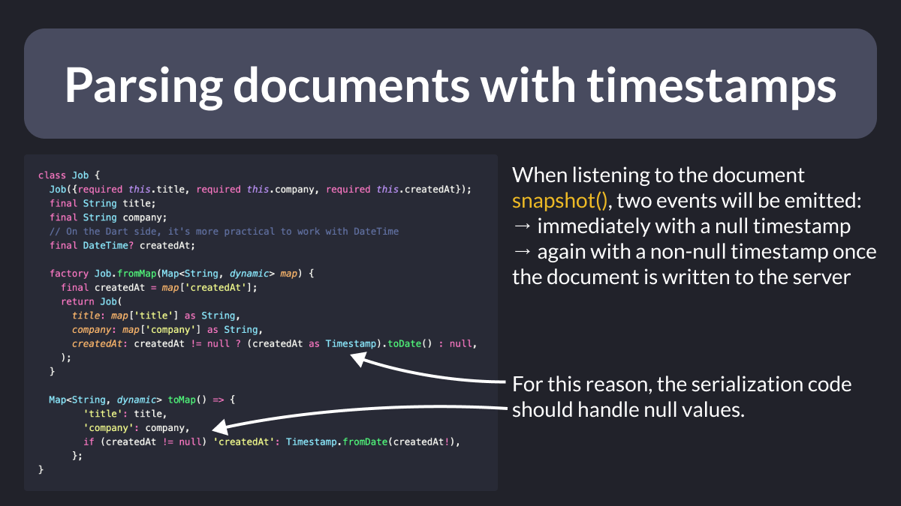

# Using `serverTimestamp()` in Firestore

Sometimes it's useful to add a timestamp to documents in Firestore, so they can be ordered later.

For that, prefer using `serverTimestamp()`.

This always uses the UTC time standard, and is more reliable that using `DateTime.now()` on the client.

---

In your serialization code, you can then use `Timestamp.toDate()` and `Timestamp.fromDate()` to get the corresponding `DateTime`.

Note that two snapshots will be emitted:
- immediately with a null timestamp
- again with a non-null timestamp once the document is written to the server

---

### Found this useful? Show some love and share the [original tweet](https://twitter.com/biz84/status/1615261153462030336) 🙏

---

| Previous | Next |
| -------- | ---- |
| [The Accessibility Tools package](../0088-list-single/index.md) |  |