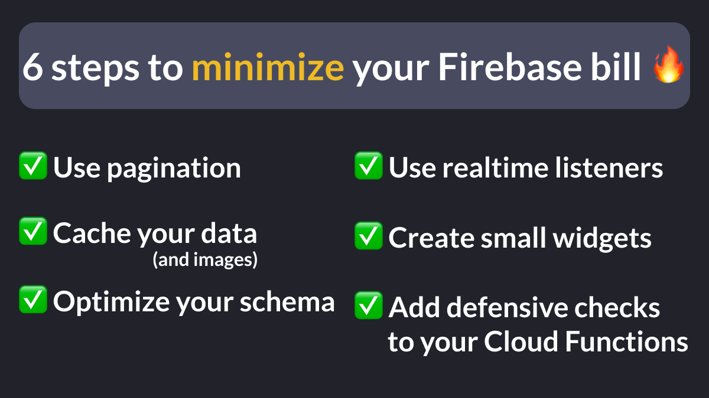
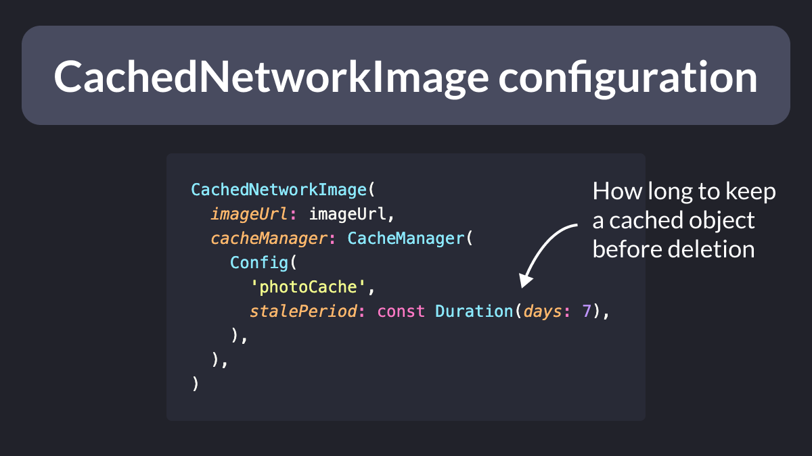
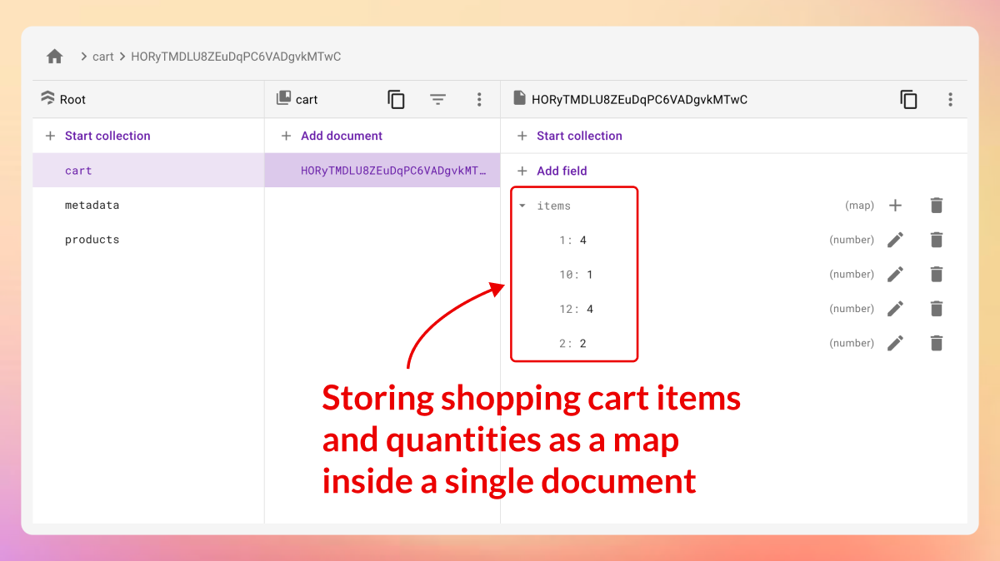

# 6 steps to minimize your Firebase Bill

How do you minimize the cost of your Firebase bill?

Here are some tips I found useful in my projects. 👇

Thread 🧵

---

### 1: Use pagination

If your collection contains 1000 documents, but the user can only see 10 at a time, you can save 100x document reads by enabling pagination.

And this is very easy to do with the [firebase_ui_firestore](https://pub.dev/packages/firebase_ui_firestore) package.

More info here: [Firestore Pagination Made Easy with FirestoreListView in Flutter](https://codewithandrea.com/articles/firestore-pagination-list-view/)

---

### 2a: Cache your data

When your app is online, Firestore always retrieves up-to-date data by default (using a server-then-cache policy).

But if you know that the data doesn’t change often, you can implement some client-side caching to avoid unnecessary reads.

---

### 2b: Cache your data

If you use Riverpod, you can use FutureProvider or StreamProvider and get data caching for free (as long as you have at least 1 active listener) or by using the `keepAlive` flag.

Note: Riverpod does in-memory caching only and doesn't persist data on storage.

---

### 2c: Cache your images

If your app loads images from Firebase Storage, you can use the CachedNetworkImage package to cache them. 

Bonus: for more fine-grained control, add a `CacheManager` and configure the `stalePeriod` property. 👌

---

### 3: Optimize your Firestore schema

Sometimes you need to use a Firestore collection to store an array/list of items.

But in some cases, you can store the same items as a list or a map inside a *single* document.

As a result, you only pay for 1 read/write rather than N.

---

### 4: Use Realtime Listeners

This may seem counter-intuitive.

But using realtime listeners (vs one-time reads) can *decrease* your total reads by preventing over-fetching when you have a spotty network connection.

So let Firestore do the right thing for you. 👌

---

### 5: Create small widgets

Large widget classes make your code hard to read and can cause performance issues.

And they can cost you money, too, because unnecessary rebuilds can lead to additional, unexpected data reads.

Small widgets = more performant app (and cheaper to run).

---

### 6: Add defensive checks to your Cloud Functions

If you’re not careful, your cloud functions may be called recursively and cause infinite loops. 😱

Such errors can be caught early if you use the Firebase Local Emulator.

And they can be fixed by adding some preconditions. 👇

---

The tips above will help you avoid some (costly) mistakes.

But don't forget to monitor the actual usage in the Firebase console.

This way, you can dig deeper and focus your efforts where it matters the most!

---

Hopefully, the above tips will help you with the low-hanging fruit.

But there's much more to learn when it comes to minimizing the cost of your Firebase bill.

Should I write a more detailed article about it? Let me know in the comments below.

---

### Found this useful? Show some love and share the [original tweet](https://twitter.com/biz84/status/1679472787495215106) 🙏

---

| Previous | Next |
| -------- | ---- |
| [Conditional JSON parsing in Dart 3](../0113-conditional-json-parsing/index.md) | |
