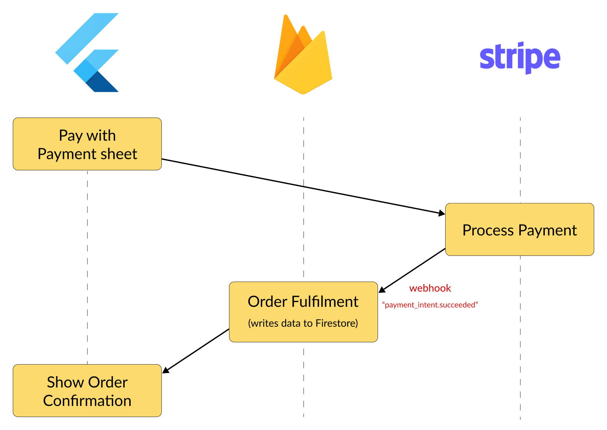

# How to work with webhooks?

How do webhooks work, and when should you use them?

Common use cases include:
- Implementing in-app subscriptions with RevenueCat
- Accepting payments using Stripe

But if you never used webhooks before, you may find them confusing.

So let's dive in. 🧵

---

Webhooks are a technique used for *server-to-server* communication.

Using webhooks, a 3rd party server (such as Stripe) can notify your backend when certain events take place (e.g. a customer purchases a product).

Note: your Flutter app does *not* talk with webhooks directly.

---

But why/when should we use webhooks in the first place?

Sensitive data (such as payments) should *not* be processed on the client for security reasons.

And it would be unreliable, too, since the Flutter app could be backgrounded or killed at any time by the OS.

---

Instead, we should deploy our webhook on the backend (which is a secure environment we have control over).

When the webhook is called, we can process the incoming event and update the DB.

All the Flutter client needs to do is listen to DB updates and rebuild the UI.

---

I have written a detailed article about webhooks, which covers:

- Example Stripe integration
- How to create and deploy webhooks as Cloud Functions
- How to secure your webhooks with signature verification

You can read it here:

- [What are Webhooks and How to Use Them in Your Flutter Backend](https://codewithandrea.com/articles/webhooks-flutter-backend/)

---

### Found this useful? Show some love and share the [original tweet](https://twitter.com/biz84/status/1711743782398394863) 🙏

---

| Previous | Next |
| -------- | ---- |
| [Xcode 15 DT_TOOLCHAIN_DIR issue](../0125-xcode-15-cocoapods-issue/index.md) | [Full-Text Search: Firestore Extensions](../0127-full-text-search/index.md) |

